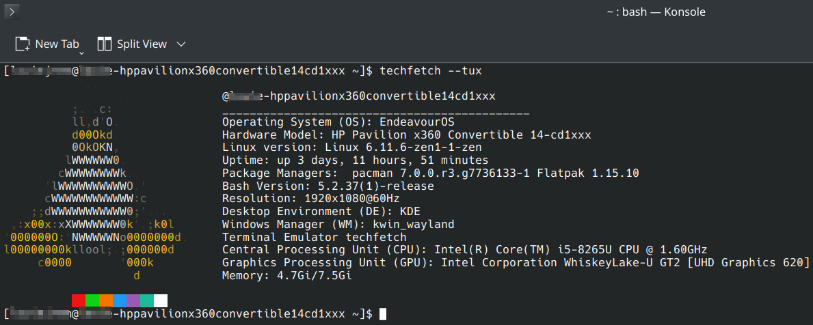

<p align="center">
    
  </a>

  <h3 align="center">Techfetch</h3>

  <p align="center"> Techfetch is a light(ish) Neofetch like CLI tool :D </p>


## Table of contents

- [Quick start](#quick-start)
- [Status](#status)
- [What's included](#whats-included)
- [Bugs and feature requests](#bugs-and-feature-requests)
- [Contributing](#contributing)
- [Creators](#creators)
- [Thanks](#thanks)
- [Copyright and license](#copyright-and-license)


## Quick start

Sorry about it you can edit it but this was hard to do okie? (｡•́︿•̀｡) (I trieddd sumone help mehh ᴖ̈):
1. Download TechFetch folder & techfetch file
2. Also please download jp2a :D
3. Make Techfetch.sh & techfetch both excecutable (Kinda like "chmod +x /usr/local/bin/techfetch | chmod +x /usr/local/bin/TechFetch/Techfetch.sh")
4. Run in terminal "techfetch" (P.S: techfetch --tux runs tux as pfp :D)

## What's included


```
/
└── usr
     └── .local
            └── bin
                 ├──  techfetch(.sh)             
                 ├──  TechFetch
                         └── Arch.png
                         └── Tux.png
                         └── EndevourOS.png
                         └── Techfetch.sh

```
## Creators

**Creator 1**

- <https://github.com/KapiKaine>

## Thanks

Some Text

## Copyright and license

Code and documentation copyright 2023-2024 the authors. Code released under the [MIT License](https://reponame/blob/master/LICENSE).

I dids it :33333
